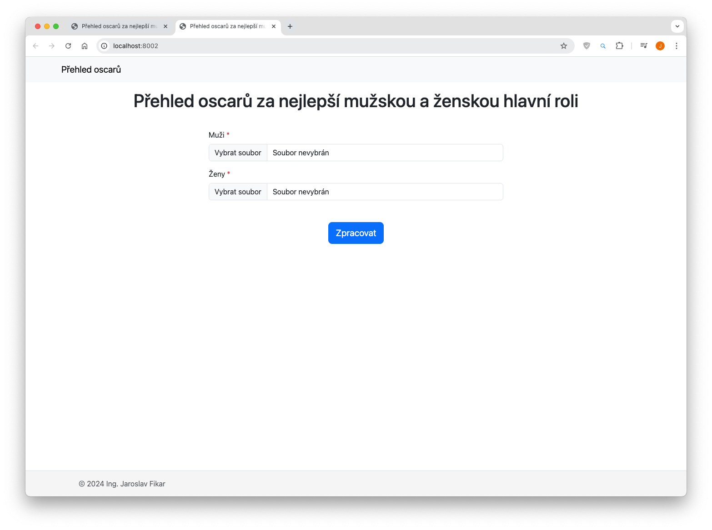

# Přehled oscarů
Ing. Jaroslav Fikar (jaroslav.fikar@proton.me)

## Ukázka



## Požadavky
- docker

## Využité technologie
- PHP 8.3
- Composer
- Bootstrap 5.3


## Spuštění
1. Sestavení Docker image:
```bash
docker build -t <image_name> .
```

2. Spuštění Docker kontejneru:
```bash
docker run -p <hostitelsky_port>:80 -v ./:/var/www/html/ <image_name> 
```

3. Aplikace je dostupná na adrese:
```
http://localhost:<hostitelsky_port>
```